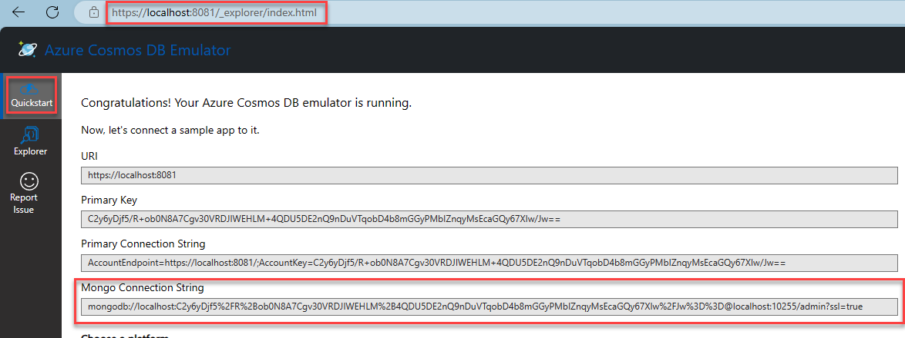

# Create your first Cosmos DB project

In this section, we'll cover how to create your first Cosmos DB project. We'll use a notebook to demonstrate the basic CRUD operations. We'll also cover how to use the Azure Cosmos DB Emulator to test your code locally.

## Emulator support

Azure Cosmos DB has an emulator that you can use to develop your code locally. The emulator supports the API for NoSQL and API for MongoDB. Usage of the emulator does not require an Azure Subscription nor does it incur any costs so is ideal for local development and testing. The Azure Cosmos DB emulator can also be utilized with unit tests in a [GitHub Actions CI workflow](https://learn.microsoft.com/en-us/azure/cosmos-db/how-to-develop-emulator?tabs=windows%2Cpython&pivots=api-mongodb#use-the-emulator-in-a-github-actions-ci-workflow).

There is not 100% feature parity between the emulator and the cloud service. Visit the [Azure Cosmos DB emulator](https://learn.microsoft.com/en-us/azure/cosmos-db/emulator) documentation for more details.

For Windows machines, the emulator can be installed via an installer. There is a Windows container using Docker available, however it does not currently support the API for Mongo DB. A Docker image is also available for Linux that does support the API for Mongo DB.

Learn more about the pre-requisites and installation of the emulator [here](https://learn.microsoft.com/en-us/azure/cosmos-db/how-to-develop-emulator?tabs=windows%2Cpython&pivots=api-mongodb).

>**NOTE**: When using the Azure CosmosDB emulator using the API for MongoDB it must be started with the [MongoDB endpoint options enabled](https://learn.microsoft.com/en-us/azure/cosmos-db/how-to-develop-emulator?tabs=windows%2Cpython&pivots=api-mongodb#start-the-emulator) on the command-line.

## Authentication

Authentication to Azure Cosmos DB API for Mongo DB is done using a connection string. The connection string is a URL that contains the authentication information for your Azure Cosmos DB account or local emulator. The username and password used when provisioning the Azure Cosmos DB API for MongoDB service are used in the connection string when authenticating to Azure.

### Retrieving the connection string from the Cosmos DB Emulator

The splash screen or **Quickstart** section of the Cosmos DB Emulator will display the connection string. Access this screen through the following URL: `https://localhost:8081/_explorer/index.html`.

### Retrieving the connection string from the Azure portal

Retrieve the connection string from the Azure portal by navigating to your Azure Cosmos DB account and selecting the **Connection String** menu item on the left-hand side of the screen. The connection string contains tokens for the username an password that must be replaced with the username and password used when provisioning the Azure Cosmos DB API for MongoDB service. Additional users can be added at any time using the [Azure CLI](https://learn.microsoft.com/en-us/cli/azure/cosmosdb/mongodb/user?view=azure-cli-latest).

## Authorization

Azure Cosmos DB API for MongoDB supports fine-grained role-based access control (RBAC) for authorization. There are a number of built-in roles available. The built-in roles are:
    1. read
    2. readWrite
    3. dbAdmin
    4. dbOwner

The ability to create custom roles is also available. Custom roles can be created using the [Azure CLI](https://learn.microsoft.com/en-us/azure/cosmos-db/mongodb/how-to-setup-rbac). Custom roles can include granular permissions for specific databases, collections, and operational actions. Learn more about the [Azure CLI RBAC commands to define custom roles](https://learn.microsoft.com/en-us/azure/cosmos-db/mongodb/how-to-setup-rbac#azure-cli-rbac-commands).

## Helpful tools

Visualization and querying tools:
    1. Studio 3T
    2. MongoDB Compass
    3. MongoDB Shell

## Lab 1 - Create your first Cosmos DB for MongoDB application

In this lab, we'll create a Cosmos DB for MongoDB application using a notebook. You have the choice to either use the Azure Cosmos DB Emulator or an Azure Cosmos DB account in Azure. The following concepts will be covered in this lab:
    1. Create a database
    2. Create a collection
    3. Create a document
    4. Read a document
    5. Update a document
    6. Delete a document
    7. Query documents

Please visit the lab repository to complete this lab.
